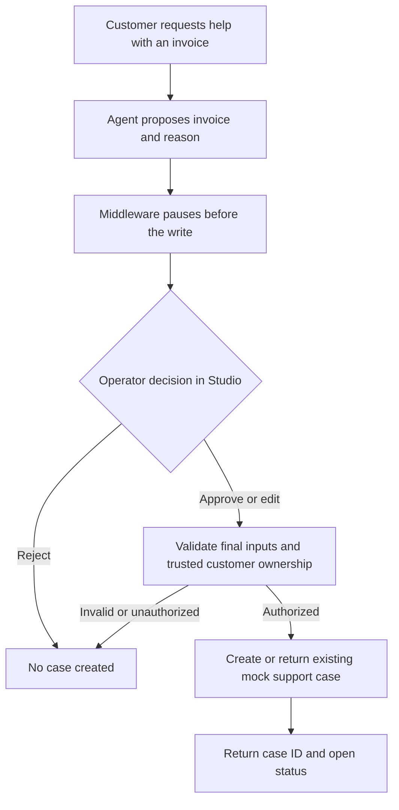

# Phase 3 plan — controlled support requests

Updated: 2026-09-24. **Implementation and verification complete.** See
[Phase 3 status](PHASE3_STATUS.md) for evidence. This document preserves the design. Phases 1 and 2
provided the baseline of three tools and 65 passing offline tests.

## Implementation decisions discovered during verification

- The framework's run counter is untracked across checkpoints and resets on resume.
  Keep four calls per invocation and add a persisted 20-call thread limit, shared
  by all tools. This uses built-in middleware rather than a custom counter.
- The installed interrupt payload uses `args`, while a current documentation
  example shows `arguments`. Tests and the verifier use the actual supported shape.
- The tool validates runtime context on resume; the earlier before-agent hook is
  not relied upon. The trusted caller must maintain customer/thread binding.
- The installed middleware annotates edited tool results with the action actually
  executed. Preserve that annotation so the model explains the reviewed action.
- Studio currently renders a generic interrupt with a resume-value editor. Use
  explicit decision payloads there; do not promise dedicated approval buttons.

## Outcome and demo flow

A customer says: “I don't recognize invoice 98. Please submit a support request.”
The agent proposes a case, a human reviews it in Studio, and an approved action
creates a record in a separate mock support store. This records a request for
review; it does not approve or execute a refund, contact a support team, or change
Chinook purchases.

An ordinary purchase lookup can establish invoice details first. That lookup is
not authorization to write: execution must check ownership again after review.
Missing or ambiguous invoice/reason information requires clarification.

## Small application change

Add one model-facing tool: `create_support_request(invoice_id, reason)`.

- Customer identity still comes only from trusted `ToolRuntime` context.
- Invoice IDs are strict positive IDs; reason text is trimmed, required and bounded
  (proposed maximum: 1,000 characters). Unknown arguments are rejected or cannot
  affect identity. Neither approval nor case status is a model-selected field.
- A proposed request is not a saved case. No support row is written before approval.
- After approval, validate the final arguments and query Chinook with both the
  invoice ID and trusted customer ID. Missing and foreign invoices return the same
  `no_authorized_records` response. Approval cannot override this check.
- Return structured outcomes: `created`, `already_exists`, `no_authorized_records`
  or `temporarily_unavailable`. Report creation only after a successful commit.

## Approval and checkpointing

Use the existing `create_agent()` loop with `HumanInTheLoopMiddleware` configured
explicitly for `approve`, `edit` and `reject` on the new tool. Read tools remain
autonomous. The installed middleware supports those decisions; confirm the actual
Studio controls during the live walkthrough. See the official
[HITL guide](https://docs.langchain.com/oss/python/langchain/human-in-the-loop).

The local Agent Server continues to own checkpoints. Offline graph tests and a
standalone live helper can supply a test checkpointer. Resume the same thread with
the same trusted customer context; do not infer identity from chat or edited tool
arguments. LangGraph can replay execution around interrupts, so writes must be
safe to repeat. See [interrupt semantics](https://docs.langchain.com/oss/python/langgraph/interrupts).

The approval policy applies to every proposal, including another attempt after
rejection. The prompt should respect rejection and avoid repeated proposals unless
the user asks again. Test mixed tool batches and middleware ordering against the
existing global four-call limit, including interrupted/resumed runs.

Studio remains a trusted operator surface. It does not authenticate the customer
or reviewer. Same-customer thread/resume binding must be maintained by the trusted
caller; a deployed adapter would enforce this and reviewer permissions. During
implementation, verify how the installed runtime handles context on resume and
document/test the supported contract. Do not claim that approval middleware alone
provides thread access control or that the existing before-agent hook necessarily
runs again on resume.

## Separate support storage

Use a second SQLite file, proposed default `src/data/support.sqlite`, with an
optional `SUPPORT_DB_PATH` setting. Existing ignore rules already exclude it.
Chinook remains read-only; reject configuration pointing the support store at the
Chinook file. No new database dependency or ORM is needed.

The minimal case record contains a generated request ID, trusted customer ID,
invoice ID, approved reason, creation time and `open` status. Do not copy billing
details or customer contact data. Invoice ownership is checked against Chinook;
a foreign key cannot span these independent databases.

For this phase, allow one open case per customer/invoice, enforced by a database
unique constraint and an atomic transaction. Repeated submissions return the
existing case ID without overwriting its approved reason. This covers retries,
checkpoint replay and concurrent duplicate submissions. Case closing/reopening
and multiple case categories are outside this slice. An interrupted commit with
an uncertain outcome must be safe to retry, not assumed to have rolled back.

## File ownership

| File | Planned change |
| --- | --- |
| `src/agent/context.py` | Support-request input definition and reason constraints |
| `src/agent/tools.py` | Fourth business tool, trusted identity injection and structured outcomes |
| `src/agent/database.py` | Small scoped invoice-ownership lookup; retains read-only Chinook responsibility |
| `src/agent/support_store.py` (new) | Writable case schema, transactional inserts and duplicate handling |
| `src/agent/agent.py` | Register the tool and configure HITL alongside the existing call limit |
| `src/agent/system_prompt.py` | Clarification, proposal, rejection and truthful post-write confirmation behavior |
| `.env.example` | Optional support-store path; no secrets |
| `tests/test_support.py` (new) and `tests/test_agent.py` | Store/authorization checks and full interrupt/resume tests |
| `src/scripts/verify_live.py` | Explicit support verification scenarios and trace inspection |

The new storage module has a distinct reason to exist: it owns mutable support
records, while `database.py` owns read-only source data. Keep the flat agent package;
no additional service layers, agents, frontend or folders are needed.

## Implementation and verification order

1. Implement input validation, scoped invoice ownership, and transactional support
   storage using temporary stores in tests.
2. Add the tool, prompt and approval middleware. Confirm interrupt/resume behavior
   with the installed framework, including edits and tool-limit interaction.
3. Run the complete offline suite, lint and formatting. Required checks include:
   pending/rejected requests create no rows; approval creates one row; approved
   edits persist exactly; invalid edits or foreign/missing invoices cannot create
   cases; chat/forged identity cannot change scope; retry/concurrency returns one
   case; database failures do not produce success claims; Chinook remains unchanged.
4. Run live model checks, then Studio approve/reject/edit scenarios. Inspect both
   the actual support-store rows and the hosted traces across pause/resume. Use
   clearly identified local demo cases; do not auto-approve arbitrary interactions.
5. Record actual results and trace links in `docs/PHASE3_STATUS.md` when verified.
   Retain this plan as the design record, updating it if implementation decisions change.

Phase 3 is complete only when the write/approval boundary is demonstrated end to
end and existing purchase/discovery behavior still passes regression checks.

## Documentation as work progresses

- README stays the short entry point and states what is implemented versus planned.
- `docs/ARCHITECTURE.md` gains the actual support flow and file responsibilities
  alongside the implementation, rather than describing planned features as working.
- `AGENTS.md` tracks the active scope and durable decisions.
- `FRICTION_LOG.md` records observed problems and resolutions, not predicted failures.
- Phase status files preserve verified evidence and remaining limitations.

Phase 4 evaluation experiments and Phase 5 interview preparation remain later work.
